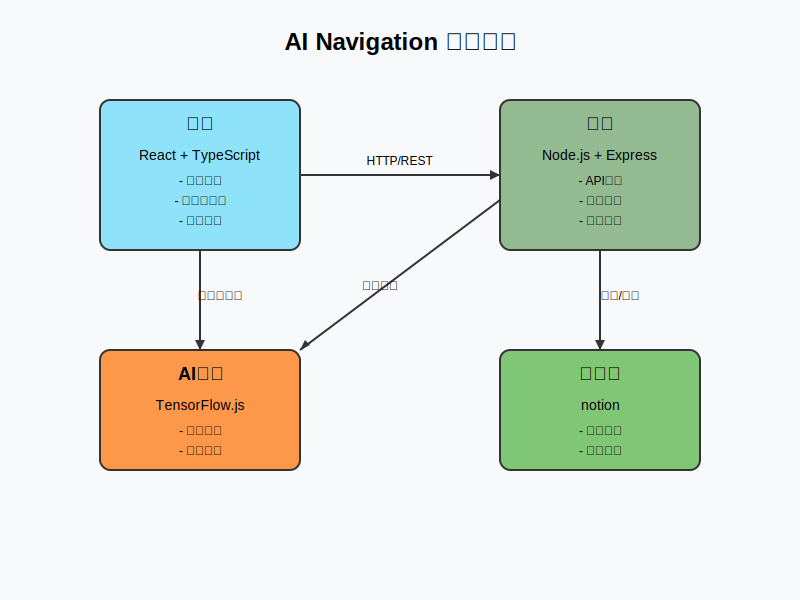

# AI Navigation

AI Navigation 是一个智能导航系统，旨在为用户提供智能化的路径规划和导航服务。

## 功能特点

- 智能路径规划
- 实时导航指引
- 多模态交互界面
- 自适应路径优化

## 系统架构



## 技术栈

- 前端：React + TypeScript
- 后端：Node.js + Express
- 数据库：MongoDB
- AI 模型：TensorFlow.js

## 安装说明

1. 克隆仓库

```bash
git clone https://github.com/your-username/AI-Navigation.git
```

AI-Navigation/
├── src/
│ ├── components/ # React 组件
│ ├── services/ # 业务逻辑服务
│ ├── utils/ # 工具函数
│ └── pages/ # 页面组件
├── public/ # 静态资源
└── docs/ # 项目文档

## 使用说明

1. 打开应用后，在搜索框中输入目的地
2. 系统会自动计算最优路径
3. 按照导航指示前进即可

## 贡献指南

欢迎提交 Pull Request 或创建 Issue。

## 许可证

本项目采用 MIT 许可证。详见 LICENSE 文件。

## 联系方式

- 项目维护者：hzhu
- 邮箱：[ 1369129052@qq.com ]

## 致谢

感谢所有为这个项目做出贡献的开发者。
